# Design Document

## Overview

The SSO authentication failure on Cloudflare Pages is caused by several configuration mismatches between the local development environment and the production deployment. The primary issues are incorrect environment variables, missing OAuth redirect URI configurations, and potential Edge runtime compatibility problems with NextAuth.js.

## Architecture

### Current Authentication Flow

```mermaid
sequenceDiagram
    participant User
    participant CF as Cloudflare Pages
    participant NextAuth as NextAuth.js
    participant OAuth as OAuth Provider
    participant DB as Database

    User->>CF: Click "Sign In"
    CF->>NextAuth: Initialize auth request
    Note over NextAuth: ❌ Fails here due to config issues
    NextAuth-->>CF: Server configuration error
    CF-->>User: Generic error message
```


### Target Authentication Flow


## Components and Interfaces

### 1. Environment Configuration

**Problem:** The `wrangler.toml` file has hardcoded localhost URLs and missing production environment variables.

**Solution:** 
- Update `wrangler.toml` with proper environment-specific configurations
- Add production environment variables to Cloudflare Pages dashboard
- Implement environment variable validation

```typescript
interface CloudflareEnvironment {
  NEXTAUTH_URL: string;
  NEXTAUTH_SECRET: string;
  GITHUB_CLIENT_ID: string;
  GITHUB_CLIENT_SECRET: string;
  GOOGLE_CLIENT_ID: string;
  GOOGLE_CLIENT_SECRET: string;
}
```

### 2. NextAuth.js Configuration

**Problem:** The current NextAuth configuration may not be fully compatible with Cloudflare's Edge runtime.

**Solution:**
- Ensure Edge runtime compatibility
- Add proper error handling and logging
- Configure correct callback URLs

```typescript
interface NextAuthConfig {
  providers: Provider[];
  pages: {
    signIn: string;
    error: string;
  };
  callbacks: {
    session: SessionCallback;
    jwt: JWTCallback;
    redirect: RedirectCallback;
  };
  debug: boolean;
  logger: Logger;
}
```

### 3. OAuth Provider Configuration

**Problem:** OAuth apps are configured with localhost redirect URIs only.

**Solution:**
- Update GitHub OAuth App settings
- Update Google OAuth Client settings
- Support multiple redirect URIs for different environments

### 4. Error Handling and Logging

**Problem:** Generic error messages make debugging difficult.

**Solution:**
- Implement comprehensive error logging
- Add environment variable validation
- Create custom error pages

## Data Models

### Environment Variables Schema
```typescript
interface EnvironmentConfig {
  // Core NextAuth configuration
  NEXTAUTH_URL: string;           // Production domain URL
  NEXTAUTH_SECRET: string;        // Secure random string
  
  // OAuth Provider Credentials
  GITHUB_CLIENT_ID: string;
  GITHUB_CLIENT_SECRET: string;
  GOOGLE_CLIENT_ID: string;
  GOOGLE_CLIENT_SECRET: string;
  
  // Optional debugging
  NEXTAUTH_DEBUG?: boolean;
}
```

### OAuth Provider Settings
```typescript
interface OAuthProviderConfig {
  github: {
    clientId: string;
    clientSecret: string;
    redirectUris: string[];
  };
  google: {
    clientId: string;
    clientSecret: string;
    redirectUris: string[];
  };
}
```

## Error Handling

### Configuration Validation
- Validate all required environment variables at startup
- Provide clear error messages for missing or invalid configurations
- Log configuration issues without exposing sensitive data

### OAuth Flow Error Handling
- Catch and log OAuth provider errors
- Handle redirect URI mismatches gracefully
- Provide user-friendly error messages

### Edge Runtime Compatibility
- Ensure all NextAuth.js features work with Cloudflare's Edge runtime
- Handle any runtime-specific limitations
- Implement fallbacks where necessary

## Testing Strategy

### Environment Testing
1. **Local Development**: Verify authentication works with localhost
2. **Preview Deployment**: Test with Cloudflare Pages preview URLs
3. **Production Deployment**: Validate with final production domain

### OAuth Provider Testing
1. **GitHub OAuth**: Test complete flow with GitHub provider
2. **Google OAuth**: Test complete flow with Google provider
3. **Error Scenarios**: Test various failure modes and error handling

### Configuration Testing
1. **Environment Variables**: Validate all required variables are present
2. **Redirect URIs**: Confirm OAuth providers accept configured URIs
3. **Edge Runtime**: Ensure NextAuth.js works correctly in Edge environment

## Implementation Plan

### Phase 1: Environment Configuration
1. Update `wrangler.toml` with environment-specific settings
2. Configure Cloudflare Pages environment variables
3. Add environment variable validation

### Phase 2: OAuth Provider Setup
1. Update GitHub OAuth App with production redirect URIs
2. Update Google OAuth Client with production redirect URIs
3. Test OAuth provider configurations

### Phase 3: NextAuth.js Enhancement
1. Improve error handling and logging
2. Add custom error pages
3. Ensure Edge runtime compatibility

### Phase 4: Testing and Validation
1. Test authentication flow in all environments
2. Validate error handling scenarios
3. Confirm production deployment works correctly

## Security Considerations

### Environment Variable Security
- Store sensitive credentials securely in Cloudflare Pages
- Never expose secrets in client-side code
- Use proper secret rotation practices

### OAuth Security
- Validate redirect URIs strictly
- Use secure callback URL patterns
- Implement proper CSRF protection

### Session Security
- Use secure session configuration
- Implement proper session expiration
- Handle session storage securely