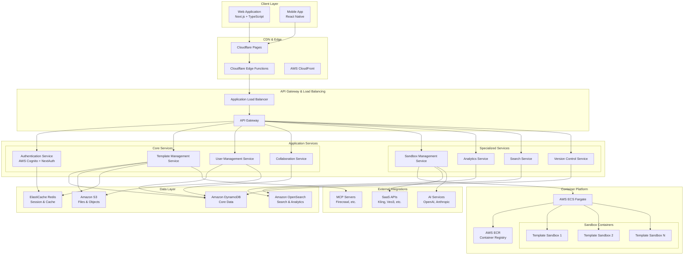
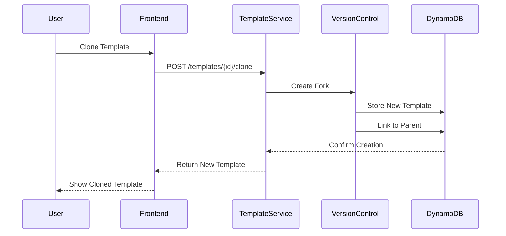
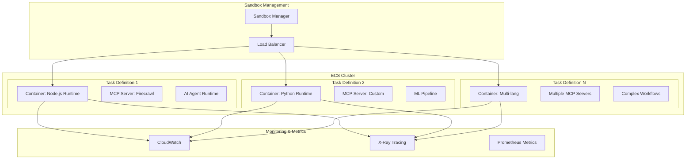
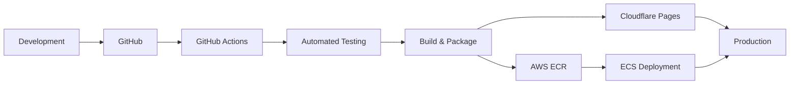

# Comprehensive Prompt Gallery Platform Architecture

## System Overview

The Prompt Gallery Platform will be a sophisticated, cloud-native application serving as a centralized repository for AI-powered application templates. The platform leverages modern web technologies with AWS infrastructure for scalability, reliability, and performance.

## Technology Stack

### Frontend
- **Framework**: Next.js 14+ with App Router
- **Language**: TypeScript
- **Styling**: Tailwind CSS + Shadcn/ui components
- **State Management**: Zustand + React Query
- **Deployment**: Cloudflare Pages with Edge Functions
- **Authentication**: NextAuth.js with AWS Cognito

### Backend
- **Runtime**: Node.js 20+ with Express.js
- **Language**: TypeScript
- **API**: RESTful APIs + GraphQL (Apollo Server)
- **Authentication**: AWS Cognito + JWT
- **Deployment**: AWS ECS Fargate

### Infrastructure & Services
- **Core Database**: Amazon DynamoDB (NoSQL)
- **Caching**: Amazon ElastiCache (Redis)
- **File Storage**: Amazon S3
- **Search & Analytics**: Amazon OpenSearch
- **Container Orchestration**: AWS ECS Fargate
- **CDN**: CloudFront
- **Monitoring**: CloudWatch + X-Ray
- **CI/CD**: GitHub Actions + AWS CodePipeline

## System Architecture Diagram



## Database Schema Design

### DynamoDB Tables Structure

```mermaid
erDiagram
    USERS {
        string userId PK
        string email
        string username
        string displayName
        object profile
        array roles
        timestamp createdAt
        timestamp updatedAt
        string cognitoId
    }
    
    TEMPLATES {
        string templateId PK
        string userId SK
        string title
        string description
        string industry
        string useCase
        object promptConfig
        object mcpServers
        object saasIntegrations
        object agentConfig
        string status
        number version
        array tags
        object metadata
        timestamp createdAt
        timestamp updatedAt
    }
    
    TEMPLATE_VERSIONS {
        string templateId PK
        number version SK
        string userId
        object changes
        string changeDescription
        object fullSnapshot
        timestamp createdAt
        string createdBy
    }
    
    COLLABORATIONS {
        string collaborationId PK
        string templateId SK
        string userId
        string role
        array permissions
        timestamp invitedAt
        timestamp acceptedAt
        string status
    }
    
    SANDBOX_SESSIONS {
        string sessionId PK
        string userId SK
        string templateId
        object containerConfig
        string status
        object metrics
        timestamp startedAt
        timestamp endedAt
        number duration
    }
    
    ANALYTICS_EVENTS {
        string eventId PK
        timestamp timestamp SK
        string userId
        string templateId
        string eventType
        object eventData
        string sessionId
    }
    
    USERS ||--o{ TEMPLATES : creates
    USERS ||--o{ COLLABORATIONS : participates
    TEMPLATES ||--o{ TEMPLATE_VERSIONS : has
    TEMPLATES ||--o{ COLLABORATIONS : includes
    TEMPLATES ||--o{ SANDBOX_SESSIONS : tested_in
    USERS ||--o{ SANDBOX_SESSIONS : runs
    USERS ||--o{ ANALYTICS_EVENTS : generates
```

## Core Features Implementation Plan

### 1. Template Management System

**Components:**
- Template CRUD operations
- JSON configuration validation
- Industry/use-case categorization
- Template inheritance and cloning
- Dependency management

**Key Features:**
```typescript
interface PromptTemplate {
  id: string;
  title: string;
  description: string;
  industry: IndustryVertical;
  useCase: string;
  promptConfig: {
    systemPrompt: string;
    userPromptTemplate: string;
    parameters: TemplateParameter[];
    constraints: PromptConstraints;
  };
  mcpServers: MCPServerConfig[];
  saasIntegrations: SaaSIntegration[];
  agentConfig: AgentOrchestrationConfig;
  metadata: TemplateMetadata;
  version: number;
  status: 'draft' | 'published' | 'archived';
}
```

### 2. Visualization & Structural Capabilities

**Architecture Flow Visualization:**
- Interactive diagrams showing LLM → MCP → Agent workflows
- Dependency graphs for template prerequisites
- Real-time execution flow visualization
- Performance bottleneck identification

**Implementation:**
- React Flow for interactive diagrams
- D3.js for complex visualizations
- Mermaid for static architecture diagrams
- Custom WebGL components for 3D visualizations

### 3. Inheritance & Cloning System

**Features:**
- Template forking with change tracking
- Selective inheritance of components
- Merge conflict resolution
- Template marketplace with ratings

**Workflow:**


### 4. Advanced Customization Features

**Customization Options:**
- Visual prompt editor with syntax highlighting
- Drag-and-drop agent tool configuration
- API endpoint management with testing
- Rate limiting and fallback configuration
- A/B testing for prompt variations

**Configuration Interface:**
- Monaco Editor for code editing
- Form builders for configuration
- Real-time validation and preview
- Template diff visualization

### 5. Sandbox Environment (AWS ECS Fargate)

**Container Architecture:**


**Sandbox Features:**
- Isolated execution environments
- Resource monitoring and limits
- Real-time logs and metrics
- Cost tracking per execution
- Performance benchmarking
- Security scanning

### 6. Version Control & Collaboration

**Git-like Features:**
- Branch-based development
- Pull request workflow for templates
- Conflict resolution interface
- Collaborative editing with operational transforms

**Real-time Collaboration:**
- WebSocket-based live editing
- Cursor tracking and user presence
- Comment and review system
- Change notifications

## Industry Verticals & Use Cases

### Media & Entertainment
- **Short Drama Production**: Automated script generation, character development, scene planning
- **ASMR Content Creation**: Audio script generation, trigger identification, personalization
- **Video Content Planning**: Storyboard generation, content optimization, audience targeting
- **Music Production**: Lyric generation, composition assistance, arrangement suggestions

### Healthcare & Life Science
- **Clinical Documentation**: Medical report generation, patient summary creation
- **Drug Discovery**: Research paper analysis, compound property prediction
- **Patient Care**: Treatment plan generation, medication management
- **Medical Education**: Case study creation, diagnostic training scenarios

### Retail
- **Product Description Generation**: Automated copywriting, SEO optimization
- **Customer Service Automation**: Chatbot responses, FAQ generation
- **Inventory Management**: Demand forecasting, stock optimization
- **Marketing Campaign Creation**: Ad copy generation, social media content

### Manufacturing
- **Quality Control**: Defect detection, process optimization
- **Supply Chain Management**: Logistics optimization, vendor communication
- **Equipment Maintenance**: Predictive maintenance, troubleshooting guides
- **Safety Compliance**: Risk assessment, safety protocol generation

### Automotive
- **Vehicle Design**: Specification generation, feature documentation
- **Customer Support**: Technical documentation, troubleshooting guides
- **Sales Assistance**: Product comparison, customer needs analysis
- **Regulatory Compliance**: Documentation generation, compliance checking

### Financial Services (FSI)
- **Risk Assessment**: Credit analysis, fraud detection
- **Regulatory Reporting**: Compliance documentation, audit preparation
- **Customer Communication**: Personalized financial advice, product recommendations
- **Market Analysis**: Research report generation, trend analysis

### Gaming
- **Game Content Generation**: Quest creation, dialogue writing, world building
- **Player Behavior Analysis**: Engagement optimization, retention strategies
- **Narrative Design**: Story development, character creation
- **Community Management**: Response generation, content moderation

## MCP Server Integration Architecture

### Supported MCP Servers
- **Firecrawl**: Web crawling and content extraction
- **Custom Data Processors**: Industry-specific data transformation
- **API Integrators**: Third-party service connections
- **File Processors**: Document analysis and conversion

### Integration Patterns
```typescript
interface MCPServerConfig {
  serverId: string;
  serverType: 'firecrawl' | 'custom' | 'api-integrator' | 'file-processor';
  configuration: {
    endpoint: string;
    authentication: AuthConfig;
    rateLimit: RateLimitConfig;
    fallback: FallbackConfig;
  };
  tools: MCPTool[];
  resources: MCPResource[];
}

interface MCPTool {
  name: string;
  description: string;
  inputSchema: JSONSchema;
  outputSchema: JSONSchema;
  costEstimate: CostConfig;
}
```

### SaaS Integration Framework
```typescript
interface SaaSIntegration {
  provider: 'kling' | 'veo3' | 'openai' | 'anthropic' | 'custom';
  service: string;
  configuration: {
    apiKey: string;
    endpoint: string;
    version: string;
    rateLimit: RateLimitConfig;
    costTracking: CostTrackingConfig;
  };
  capabilities: ServiceCapability[];
}

interface ServiceCapability {
  type: 'video-generation' | 'text-generation' | 'image-processing' | 'audio-synthesis';
  parameters: CapabilityParameter[];
  constraints: CapabilityConstraint[];
}
```

## Security Architecture

### Authentication & Authorization
- **AWS Cognito**: User pool management, MFA support
- **JWT Tokens**: Stateless authentication with refresh mechanism
- **Role-Based Access Control (RBAC)**: Granular permissions system
- **API Key Management**: Secure storage and rotation for external integrations

### Container Security
- **Least Privilege Execution**: Minimal container permissions
- **Network Isolation**: VPC and security group restrictions
- **Resource Limits**: CPU, memory, and network constraints
- **Vulnerability Scanning**: Automated security assessments

### Data Protection
- **Encryption at Rest**: DynamoDB and S3 encryption
- **Encryption in Transit**: TLS 1.3 for all communications
- **API Rate Limiting**: DDoS protection and abuse prevention
- **Audit Logging**: Comprehensive activity tracking

## Performance & Scalability

### Caching Strategy
- **Redis Caching**: Session data and frequently accessed templates
- **CloudFront CDN**: Static assets and API response caching
- **Application Caching**: Expensive operation result caching
- **Database Query Optimization**: Efficient DynamoDB access patterns

### Auto-scaling Configuration
- **ECS Fargate**: CPU and memory-based scaling
- **DynamoDB**: On-demand capacity scaling
- **ElastiCache**: Cluster node scaling
- **CloudFront**: Global edge location distribution

### Performance Monitoring
- **Real-time Metrics**: Custom CloudWatch dashboards
- **Performance Budgets**: Automated alerts and thresholds
- **User Experience Monitoring**: Core Web Vitals tracking
- **Cost Optimization**: Resource utilization analysis

## Deployment Architecture

### CI/CD Pipeline


### Environment Strategy
- **Development**: Local development with Docker Compose
- **Staging**: AWS environment mirroring production
- **Production**: Multi-AZ deployment with automatic failover

### Infrastructure as Code
- **AWS CDK**: Infrastructure definition and deployment
- **Terraform**: Multi-cloud resource management
- **Docker**: Containerization and image management
- **Kubernetes Manifests**: Container orchestration configuration

## Cost Optimization

### Resource Management
- **Spot Instances**: Cost-effective compute for non-critical workloads
- **Reserved Instances**: Predictable workload cost optimization
- **Automatic Cleanup**: Unused resource identification and removal
- **Cost Allocation Tags**: Detailed expense tracking and attribution

### Monitoring & Alerts
- **AWS Cost Explorer**: Detailed cost analysis and forecasting
- **Budget Alerts**: Spending limit notifications
- **Resource Utilization**: Efficiency monitoring and optimization
- **Optimization Recommendations**: Automated cost-saving suggestions

## Implementation Phases

### Phase 1: Core Platform (Weeks 1-4)
**Deliverables:**
- Basic template CRUD operations
- User authentication and management system
- Simple visualization components
- Basic sandbox environment setup
- Core database schema implementation

**Key Milestones:**
- User registration and login functionality
- Template creation and editing interface
- Basic template storage and retrieval
- Simple container execution environment

### Phase 2: Advanced Features (Weeks 5-8)
**Deliverables:**
- Template inheritance and cloning system
- Advanced customization interface
- Real-time collaboration features
- Enhanced sandbox capabilities with monitoring
- MCP server integration framework

**Key Milestones:**
- Template forking and merging functionality
- Collaborative editing with conflict resolution
- Advanced sandbox monitoring and metrics
- Integration with external MCP servers

### Phase 3: Analytics & Optimization (Weeks 9-12)
**Deliverables:**
- Comprehensive analytics dashboard
- Performance monitoring and optimization
- Cost tracking and optimization features
- Advanced search and discovery capabilities
- Template marketplace with ratings

**Key Milestones:**
- Real-time analytics and reporting
- Performance optimization recommendations
- Advanced search with filtering and sorting
- Template rating and review system

### Phase 4: Enterprise Features (Weeks 13-16)
**Deliverables:**
- Advanced security and compliance features
- Enterprise SSO integration
- Advanced deployment and CI/CD workflows
- Comprehensive API documentation
- Mobile application support

**Key Milestones:**
- Enterprise-grade security implementation
- Complete API documentation and SDK
- Mobile app deployment
- Production-ready deployment pipeline

## Quality Assurance & Testing

### Testing Strategy
- **Unit Testing**: Jest for backend, React Testing Library for frontend
- **Integration Testing**: API endpoint and database integration tests
- **End-to-End Testing**: Playwright for complete user workflow testing
- **Performance Testing**: Load testing with Artillery and K6
- **Security Testing**: OWASP compliance and vulnerability scanning

### Code Quality
- **TypeScript**: Strong typing for better code reliability
- **ESLint & Prettier**: Code formatting and linting standards
- **Husky**: Pre-commit hooks for code quality enforcement
- **SonarQube**: Code quality and security analysis
- **Dependency Scanning**: Automated vulnerability detection

## Monitoring & Observability

### Application Monitoring
- **AWS CloudWatch**: Infrastructure and application metrics
- **AWS X-Ray**: Distributed tracing and performance analysis
- **Custom Metrics**: Business-specific KPIs and analytics
- **Error Tracking**: Sentry for error monitoring and alerting

### Business Intelligence
- **Usage Analytics**: User behavior and feature adoption tracking
- **Performance Metrics**: Template execution and success rates
- **Cost Analytics**: Resource utilization and optimization insights
- **User Feedback**: Rating and review analysis

## Compliance & Governance

### Data Governance
- **Data Classification**: Sensitive data identification and handling
- **Data Retention**: Automated data lifecycle management
- **Privacy Compliance**: GDPR and CCPA compliance measures
- **Audit Trails**: Comprehensive activity logging and reporting

### Security Compliance
- **SOC 2 Type II**: Security and availability compliance
- **ISO 27001**: Information security management standards
- **OWASP**: Web application security best practices
- **Regular Security Audits**: Third-party security assessments

This comprehensive architecture provides a robust foundation for the Prompt Gallery Platform, ensuring scalability, security, and excellent user experience while maintaining cost efficiency and operational excellence.