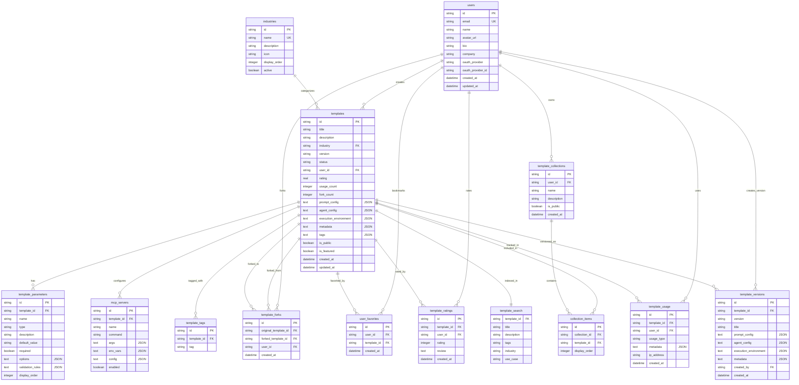

# HeyAgent Database Schema Summary

## Overview
The HeyAgent platform uses a comprehensive relational database schema built on Cloudflare D1 (SQLite) to support AI template management, user collaboration, and analytics.

## Core Entities

### User Management
- **users**: Core user profiles with OAuth authentication
- **user_favorites**: User bookmarks for templates

### Template System
- **templates**: Main template entities with JSON configurations
- **template_parameters**: Dynamic parameters for template customization
- **template_versions**: Version history and snapshots
- **template_forks**: Fork relationships between templates
- **template_tags**: Many-to-many tag associations
- **template_ratings**: User reviews and ratings

### MCP Integration
- **mcp_servers**: Model Context Protocol server configurations per template

### Collections & Organization
- **template_collections**: User-created template playlists
- **collection_items**: Many-to-many collection membership
- **industries**: Reference data for industry categorization

### Analytics & Search
- **template_usage**: Usage tracking and analytics
- **template_search**: Full-text search virtual table (FTS5)

## Key Features
- **Multi-industry Support**: 8 industry verticals with specialized templates
- **Version Control**: Complete template history with snapshots
- **Social Features**: Ratings, reviews, favorites, and forking
- **Full-text Search**: SQLite FTS5 for advanced template discovery
- **MCP Integration**: Seamless Model Context Protocol server management
- **Analytics**: Comprehensive usage tracking and metrics

## Table Relationships Diagram



## JSON Column Structures

### templates.prompt_config
```json
{
  "systemPrompt": "string",
  "userPromptTemplate": "string", 
  "parameters": ["array of parameter names"]
}
```

### templates.agent_config
```json
{
  "orchestration": "object",
  "monitoring": "object"
}
```

### templates.execution_environment
```json
{
  "infrastructure": "requirements object",
  "dependencies": ["array"],
  "resources": "object"
}
```

### templates.metadata
```json
{
  "category": "string",
  "complexity": "string",
  "dependencies": ["array"],
  "estimatedCost": "number"
}
```

## Performance Optimizations
- **Indexes**: Strategic indexes on foreign keys, status fields, and search columns
- **FTS5**: Full-text search with automatic triggers for real-time updates
- **JSON Columns**: Flexible schema for complex configurations
- **Cascade Deletes**: Proper cleanup of related records
- **Unique Constraints**: Data integrity for critical relationships